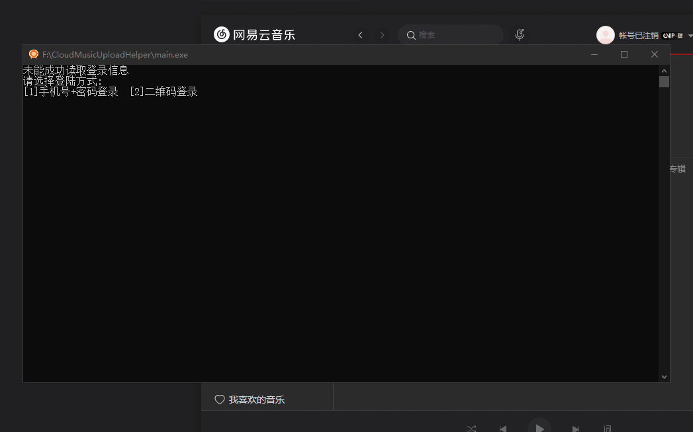
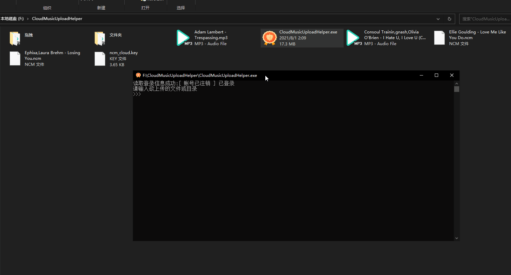
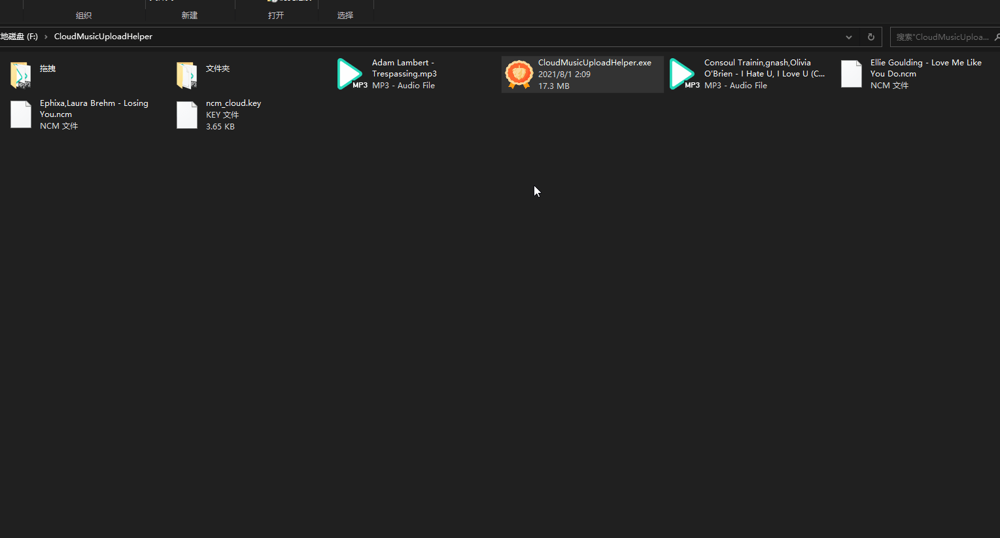

# CloudMusicUploadHelper 2.0
一个可以帮你轻松上传自有音乐至网易云音乐云盘的小工具 2.0重构版

## 注意
⚡ 本项目不会记录你的任何信息, 所有信息均加密储存在当前文件夹下`ncm_cloud.key`中,用于免登录

⚡⚡ 请不要向任何人泄露你的登陆凭证

⚡⚡⚡ 音乐云盘服务协议最终解释权归网易云音乐所有

### 支持功能
1, 支持手机号+密码以及二维码两种登陆方式

2, 自动解密`*.ncm`网易云音乐加密格式

3, 支持单\多文件, 文件夹上传

4, 上传失败自动重试

### 使用方法
* 初次使用, 需要打开填写信息登录, 一次登陆后会保存登录凭据, 免下次登陆
* 具体使用方法请参考下方图片

### 特别感谢

感谢由[@greats3an](https://github.com/greats3an/pyncm)开发的PyNCM第三方库